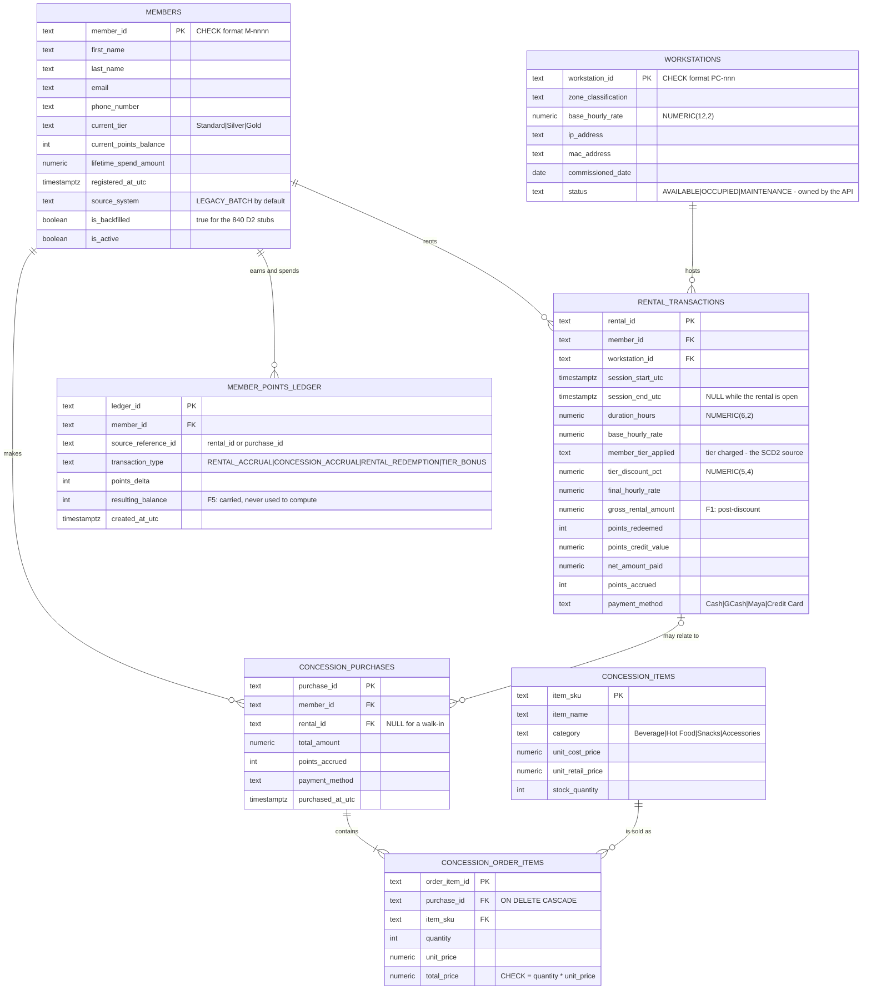
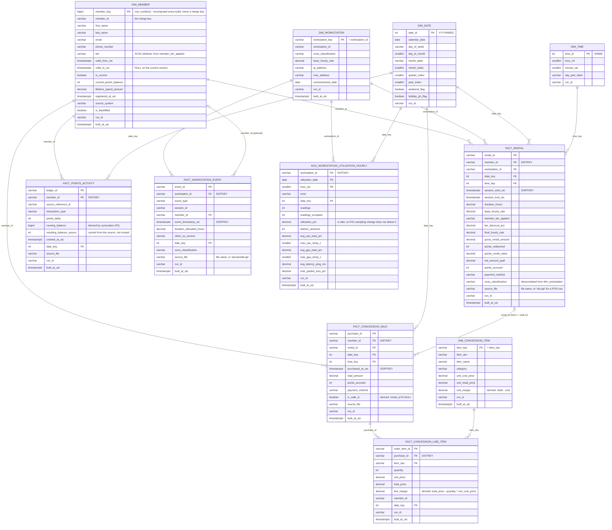
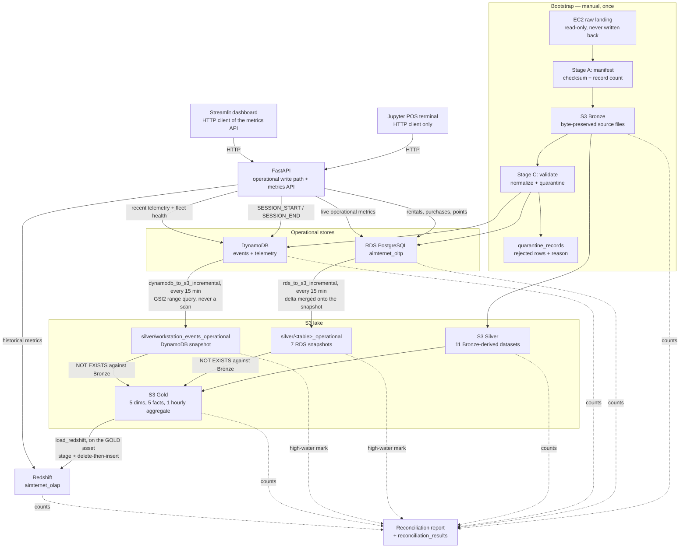
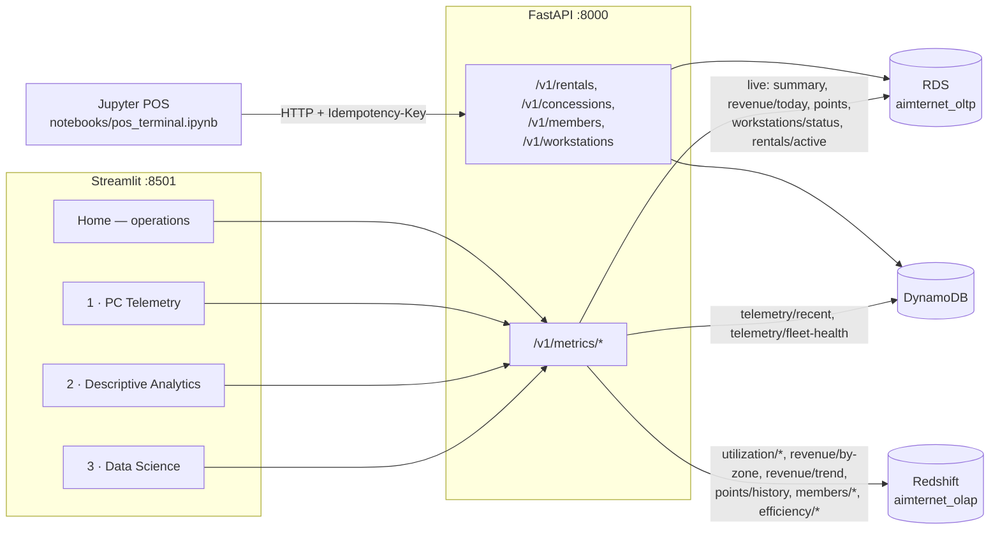

# Pipeline schema diagrams

Every diagram here is drawn from the code, not from the plan: the OLTP tables come from
`src/aimternet/db/migrations/*.up.sql`, the warehouse from `src/aimternet/db/redshift_ddl/schema.sql`,
the Silver/Gold datasets from `src/aimternet/pipeline/curate/`, the DynamoDB keys from
`src/aimternet/pipeline/loaders/dynamodb.py` and `infra/dynamodb.tf`, and the schedules from `dags/`.

Relationship lines in the OLAP diagram are logical analytical joins; Redshift declares primary
keys as optimiser hints and enforces neither them nor foreign keys.

An editable draw.io version of the two ER diagrams lives beside this file:
[`aimternet_erd.drawio`](aimternet_erd.drawio) (three pages — OLTP, control plane, OLAP).
Regenerate it with `make erd`.

## 1. OLTP schema (PostgreSQL `aimternet_oltp`)

Money is `NUMERIC(12,2)` everywhere and never a float; every instant is `TIMESTAMPTZ` in UTC with
the source's original `+08:00` kept beside it as `source_tz_offset`. Every table below also carries
the lineage quartet `source_file`, `source_checksum`, `ingested_at_utc`, `run_id`, omitted from the
diagram so the business columns stay readable.



Constraints that carry weight rather than merely documenting intent:

| Object | Kind | What it guarantees |
|---|---|---|
| `one_open_rental_per_workstation` | partial `UNIQUE` on `(workstation_id) WHERE session_end_utc IS NULL` | Double check-in is impossible at the storage layer, so check-in correctness does not depend on the API winning a read-then-write race. |
| `one_open_rental_per_member` | partial `UNIQUE` on `(member_id) WHERE session_end_utc IS NULL` | One member cannot hold two machines at once. |
| `closed_rental_is_priced` | `CHECK` | A rental with an end time must have every money column populated; an open one may be incomplete. |
| `credit_never_exceeds_gross` | `CHECK` | Points redemption can never make a session negative-revenue. |
| `line_total_is_quantity_times_unit_price` | `CHECK` | The §4 cross-file invariant, enforced rather than checked downstream. |
| `manifest_file_checksum_unique` | `UNIQUE (source_file, checksum)` | Re-registering an unchanged file is a no-op, which is what makes the bootstrap re-runnable. |

## 2. Control-plane tables (same schema, not business data)

These live beside the business tables so one backup — or one `DROP SCHEMA` — covers everything
this POC created. They have no foreign keys to the business tables on purpose: pipeline state must
survive a reload of the data it describes.

```mermaid
erDiagram
    LOAD_MANIFEST {
        bigint manifest_id PK "GENERATED ALWAYS AS IDENTITY"
        text source_file
        text source_type
        text dataset
        date batch_date
        smallint hour_of_day
        text checksum "the idempotency key"
        bigint file_size
        timestamptz file_mtime_utc
        timestamptz load_timestamp
        text status "DISCOVERED|UPLOADED|VALIDATED|LOADED|FAILED|SKIPPED"
        int record_count
        int error_count
        text bronze_uri
        text error_detail
        text run_id
    }
    LOAD_CHECKPOINT {
        text pipeline PK "per-file completion, so a 1,488-file load resumes"
        text source_file PK
        text checksum PK "changed contents reload rather than skip"
        int records_loaded
        timestamptz completed_at
        text run_id
    }
    PIPELINE_WATERMARK {
        text pipeline_name PK "rds_to_s3:<table>, dynamodb_to_s3:workstation_events"
        text watermark_value "stamped from the database clock, not the worker's"
        timestamptz updated_at
        text run_id
    }
    QUARANTINE_RECORDS {
        bigint quarantine_id PK
        text dataset
        text source_file
        text source_checksum
        date batch_date
        text record_key
        text rejection_rule
        text rejection_detail
        text severity "ERROR|WARNING"
        jsonb raw_record "nothing is discarded silently"
        timestamptz quarantined_at
        text run_id
    }
    RECONCILIATION_RESULTS {
        bigint result_id PK
        text run_id
        text check_name "also the silver_snapshot high-water mark store"
        text layer_from
        text layer_to
        numeric expected_value
        numeric actual_value
        boolean passed
        text severity "CRITICAL|WARNING|INFO"
        text detail
        timestamptz checked_at
    }
    API_IDEMPOTENCY {
        text idempotency_key PK
        text endpoint
        text request_hash
        int response_status
        jsonb response_body "a replayed key returns the original response"
        timestamptz created_at
    }
    SCHEMA_MIGRATIONS {
        text version PK
        text name
        text checksum "editing an applied migration is refused"
        timestamptz applied_at
    }
```



## 3. OLAP schema (Redshift `aimternet_olap`)

Five dimensions, five facts and one aggregate. Every dimension is `DISTSTYLE ALL` — the largest is
~2,235 rows, so replicating them removes the redistribution step from every join for a few hundred
KB. Facts distribute on their join column and sort by time, because every question filters a date
range first.



**Load keys.** Each Gold dataset is staged and merged with delete-then-insert in one transaction, so
a rerun adds nothing. The merge key is the *business* key, never a surrogate Gold recomputes:

| Table | Merge key | Table | Merge key |
|---|---|---|---|
| `dim_member` | `member_id` | `fact_rental` | `rental_id` |
| `dim_workstation` | `workstation_key` | `fact_concession_sale` | `purchase_id` |
| `dim_date` | `date_id` | `fact_concession_line_item` | `order_item_id` |
| `dim_time` | `time_id` | `fact_points_activity` | `ledger_id` |
| `dim_concession_item` | `item_key` | `fact_workstation_event` | `event_id` |
| | | `agg_workstation_utilization_hourly` | `(workstation_id, utilization_date, hour_utc)` |

`dim_member` is the one that had to change twice: `member_key` is a `row_number()` and
`valid_from_utc` is recomputed from the rentals, so keying on either leaves stale rows behind with
the row count unchanged. `member_id` is the only column Gold does not recompute.

## 4. ETL / ELT pipeline



The POS loop is the part that took three findings to get right: a sale rung up at the till reaches
RDS, is exported to `silver/<table>_operational`, is unioned into Gold by
`gold.py::operational_source`, and lands in Redshift on the next asset-triggered load. Any layer that stops
reading its snapshot breaks the loop silently — the row count never falls, so no count check can see
it. `tests/unit/test_operational_snapshots_are_consumed.py` is what keeps it closed.

### Airflow DAGs

| DAG | Schedule | Does |
|---|---|---|
| `bootstrap_raw_landing` | manual only | Stages A–D: manifest → Bronze → validate → RDS + DynamoDB |
| `rds_to_s3_incremental` | `*/15 * * * *` → `SILVER_RDS` | Exports the 7 operational tables to Silver as full snapshots |
| `dynamodb_to_s3_incremental` | `*/15 * * * *` → `SILVER_DYNAMODB` | Exports API-emitted events to Silver as a full snapshot |
| `curate_silver_gold` | on both Silver assets → `GOLD` | Rebuilds Silver from Bronze and Gold from Silver + snapshots |
| `load_redshift` | on `GOLD` | Applies the DDL and merges Gold into the warehouse |
| `reconcile_data` | `0 */6 * * *` | Cross-layer counts and integrity checks, written to `reconciliation_results` |

The order is enforced by the assets rather than assumed from the clock: an export publishes its
asset, both assets together release `curate_silver_gold`, and its Gold asset releases
`load_redshift`. A Redshift-sourced metric therefore trails the operational store by one export
interval plus one build, rather than by however much of the hour is left. The previous
`:00`/`:15`/`:30`/`:45` stagger only *hoped* each stage finished inside its 15-minute slot.

## 5. S3 lake layout

```
s3://<bucket>/
  bronze/<dataset>/<date=YYYY-MM-DD>/…          byte-preserved CSV / JSON, immutable
  silver/<dataset>/                             Parquet + Snappy, DECIMAL(12,2) money
  silver/<table>_operational/                   full snapshots, never deltas
  gold/<dataset>/                               dimensional model, Hive-partitioned
```

| Layer | Datasets |
|---|---|
| Silver (from Bronze) | `workstations`, `concession_items`, `dim_date`, `dim_time`, `members`, `rental_transactions`, `concession_purchases`, `concession_order_items`, `member_points_ledger`, `workstation_events`, `telemetry` |
| Silver (snapshots, from RDS) | `members_operational`, `workstations_operational`, `concession_items_operational`, `rental_transactions_operational`, `concession_purchases_operational`, `concession_order_items_operational`, `member_points_ledger_operational` |
| Silver (snapshot, from DynamoDB) | `workstation_events_operational` |
| Gold | `dim_member`, `dim_workstation`, `dim_date`, `dim_time`, `dim_concession_item`, `fact_rental`, `fact_concession_sale`, `fact_concession_line_item`, `fact_points_activity`, `fact_workstation_event`, `agg_workstation_utilization_hourly` |

Hive partitions: `rental_date`, `purchase_date`, `ledger_date`, `event_date` on their respective
datasets, and `telemetry_date` + `hour_utc` on telemetry. They are partition columns only — the
Redshift loader strips them, because they are not warehouse columns.

**Which snapshots Gold reads.** Six of the eight, and the two it does not are declared with a reason
rather than merely omitted:

| Snapshot | Read by Gold? | Where |
|---|---|---|
| `members_operational` | yes | `dim_member` (the 840 D2 stubs arrive already resolved) |
| `rental_transactions_operational` | yes | `fact_rental`, and the SCD2 tier history |
| `concession_purchases_operational` | yes | `fact_concession_sale` |
| `concession_order_items_operational` | yes | `fact_concession_line_item` |
| `member_points_ledger_operational` | yes | `fact_points_activity` |
| `workstation_events_operational` | yes | `fact_workstation_event` |
| `workstations_operational` | no | The only column it adds is `status`, live occupancy — not a dimension attribute |
| `concession_items_operational` | no | The only column it adds is `stock_quantity`, which every sale decrements |

Rentals still open (`session_end_utc IS NULL`) are held back from `fact_rental` by
`gold.py::snapshot_predicate`: the API prices a session at check-out, so an open one has NULL money
columns and would drag every warehouse average down. It arrives on the first build after the guest
leaves.

## 6. DynamoDB tables

| Table | Primary key | Secondary access paths | Main use |
|---|---|---|---|
| `aimternet_workstation_events` | `PK = WS#<workstation_id>`, `SK = EVT#<timestamp>#<event_id>` | GSI1 (`SESSION#<session_id>` / timestamp) — both ends of one rental; GSI2 (`TYPE#<event_type>` / timestamp) — alert triage and the incremental export, without a scan | Session lifecycle and hardware/peripheral alerts |
| `aimternet_workstation_telemetry` | `PK = WS#<workstation_id>`, `SK = TS#<timestamp>` | none | Latest workstation state, and per-workstation time-range telemetry for the dashboard |

Both are `PAY_PER_REQUEST` and carry `prevent_destroy` in Terraform. Items are written with
`batch_writer(overwrite_by_pkeys=["PK", "SK"])`, so a replayed file rewrites rather than duplicates.

Telemetry keeps `expires_at` as its TTL attribute, written verbatim from the source. TTL enforcement
is **off** by default (`AIMTERNET_DDB_TTL_ENABLED=false`): `expires_at` is `timestamp + 7 days` and
the simulated window is already in the past, so enabling it would purge ~61 of the 62 days within
about 48 hours (finding F2).

The incremental export queries GSI2 once per event type with `GSI2SK >= watermark` — four bounded
range queries rather than one scan of a table whose telemetry sibling holds 6.3M items.

## 7. Serving layer



The POS notebook is an HTTP client and nothing else — no `psycopg2`, `boto3`, SQL or credentials,
enforced by `tests/unit/test_notebook_boundary.py`. Streamlit is the same: it talks only to the
metrics API, never to a database. Every metrics response says which store answered it
(`"source": "redshift" | "dynamodb" | "rds"`) and carries the window it actually covers, anchored to
that store's own maximum timestamp rather than to wall-clock now.
